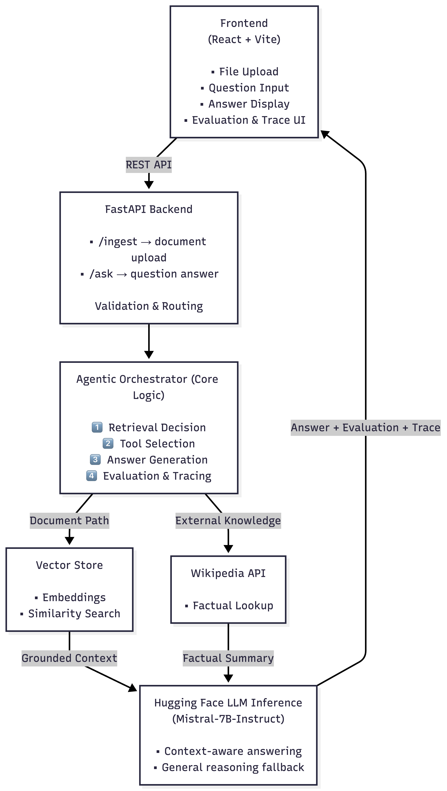
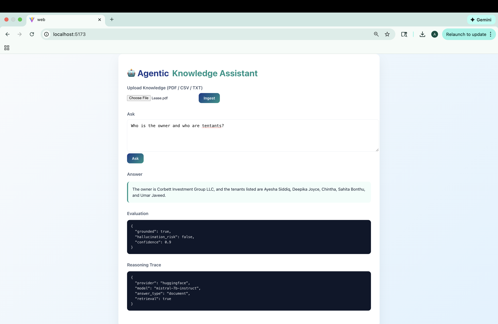
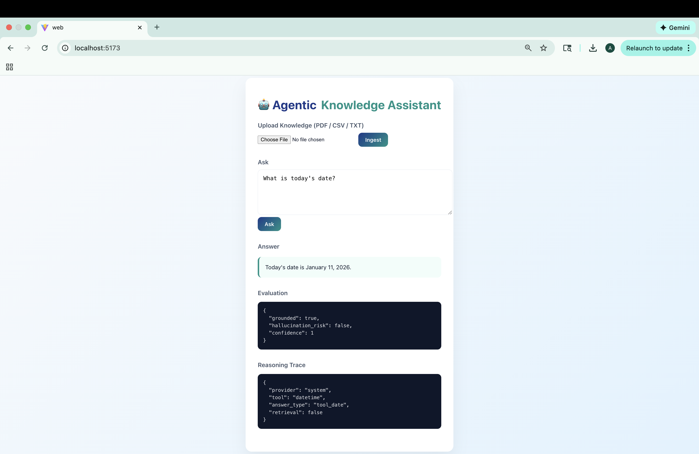
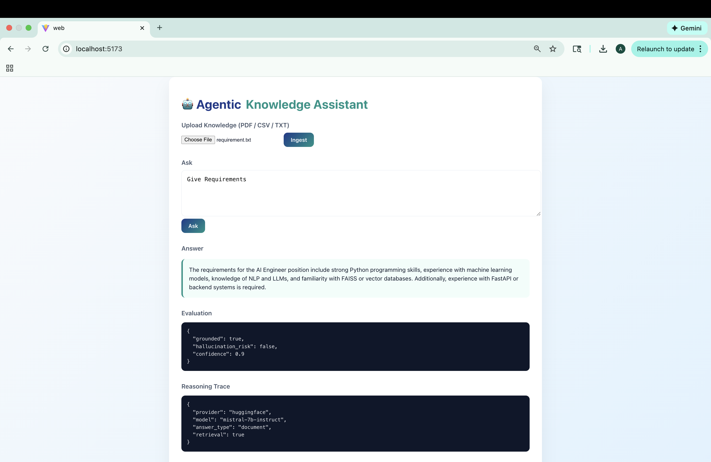

# Agentic-AI-Knowledge-Assistant
Agentic RAG • Tool-Using LLM • Evaluation-Aware AI System

An end-to-end Agentic AI system that combines Retrieval-Augmented Generation (RAG), tool selection, external knowledge sources, and evaluation tracing to answer questions reliably and transparently.

Built with React + FastAPI + Hugging Face LLMs, this system decides how to answer a question before answering it.

🚀 Key Features

📄 Document Ingestion (RAG)

Upload PDFs / CSVs / TXT

Chunking + embeddings + similarity search

🧠 Agentic Decision Logic

Decides whether to use:

Uploaded documents

Wikipedia (external knowledge)

General LLM reasoning

🌐 External Tool Integration

Wikipedia API for factual queries

🤖 LLM Inference

Hugging Face Mistral-7B-Instruct

📊 Evaluation Metrics

Grounded vs ungrounded

Hallucination risk

Confidence score

🔍 Reasoning Trace

Provider

Retrieval path

Answer type

🏗️ System Architecture

🧠 Agentic Workflow (How It Thinks)

User asks a question

Agent decides:

Is a document relevant?

Is this a factual query?

Or general reasoning?

Tool selection

Vector search (RAG)

Wikipedia API

LLM fallback

Answer generation

Evaluation & trace returned

This makes the system interpretable, not a black box.
# OUTPUTS

🛠️ Tech Stack
Frontend
React

Vite

Modern CSS (Teal + Blue theme)

Backend
FastAPI

Python 3.10+

AI / ML
Hugging Face InferenceClient

Mistral-7B-Instruct

Vector Store (FAISS or equivalent)

Wikipedia API

⚙️ Setup Instructions
1️⃣ Backend
cd backend
python -m venv venv
source venv/bin/activate
pip install -r requirements.txt

Create .env:

HF_API_TOKEN=your_huggingface_token
HF_MODEL=mistralai/Mistral-7B-Instruct-v0.2

Run:

uvicorn app.api.main:app --reload

2️⃣ Frontend
cd frontend
npm install
npm run dev
